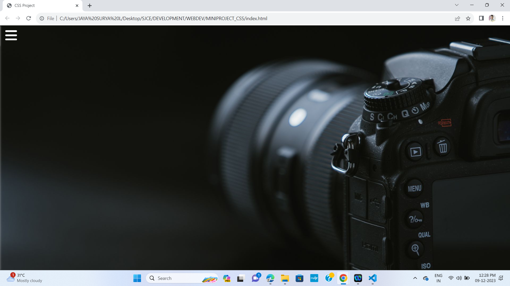

# CSS_MINIPROJECT_1

<h3>Description<h3>

This project is a simple web page with a responsive CSS-based sliding menu. The menu is triggered by a checkbox and features smooth transitions for a polished user experience. It includes a clean layout, a logo, and social media links.

 

Demo

Installation
Clone the repository: git clone https://github.com/your-username/your-repository.git
Open the project folder: cd your-repository
Open the HTML file in your browser.
Usage
Describe how to use your project. Include examples or code snippets if necessary.

html
Copy code
<!-- Example usage of the checkbox in HTML -->
<input type="checkbox" id="check" />
css
Copy code
/* Example CSS styling for the sliding menu */
.sidebar_menu {
    position: fixed;
    left: -300px;
    /* ... other styles ... */
}
Contributing
If you'd like to contribute to this project, please follow these steps:

Fork the repository.
Create a new branch: git checkout -b feature/new-feature.
Make your changes and commit them: git commit -m 'Add new feature'.
Push to the branch: git push origin feature/new-feature.
Submit a pull request.