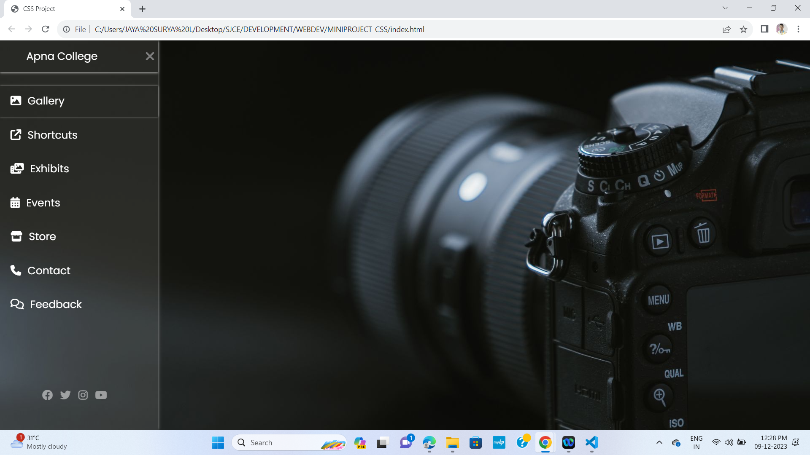

# CSS_MINIPROJECT_1

<h3>Description<h3>

This project is a simple web page with a responsive CSS-based sliding menu. The menu is triggered by a checkbox and features smooth transitions for a polished user experience. It includes a clean layout, a logo, and social media links.

 

Demo

<h3>Installation</h3>
<ul>
<li>Clone the repository: git clone https://github.com/your-username/your-repository.git</li>
<li>Open the project folder: cd your-repository</li>
<li>Open the HTML file in your browser.</li>
</ul>
 
<h3>Usage<h3>

Describe how to use your project. Include examples or code snippets if necessary.

 
<h3>Contributing</h3>

If you'd like to contribute to this project, please follow these steps:

<ul>
<li>Fork the repository.</li>
<li>Create a new branch: git checkout -b feature/new-feature.</li>
<li>Make your changes and commit them: git commit -m 'Add new feature'.</li>
<li>Push to the branch: git push origin feature/new-feature.</li>
<li>Submit a pull request.</li>